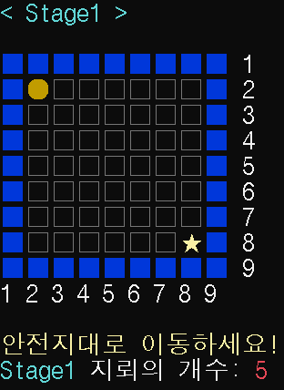

# 지뢰피하기 게임
지뢰피하기 게임은 숨겨진 지뢰를 피해 안전지대까지 도달하는 게임입니다.

## 플레이 방법
- WASD 혹은 방향키를 통해 캐릭터를 조작
- 플레이어는 숨겨진 지뢰를 피해 안전지대로 이동
- 플레이어 기준 1칸 이내 지뢰가 존재하는 경우 힌트 표시
- 안전지대 도착 시 클리어, 지뢰에 닿을 시 게임 오버

**난이도는 NORMAL / EASY 2가지 중 선택할 수 있습니다.**

## NORMAL
- 게임 도중 플레이어의 동선이 표시되지 않습니다.
- 게임이 끝난 후 모든 지뢰의 위치를 보여주지 않습니다.

>

## EASY
- 게임 도중 플레이어의 동선이 표시됩니다. (지뢰 위치를 쉽게 유추)
- 게임이 끝난 후 모든 지뢰의 위치를 보여줍니다. (위치 파악 가능)

>